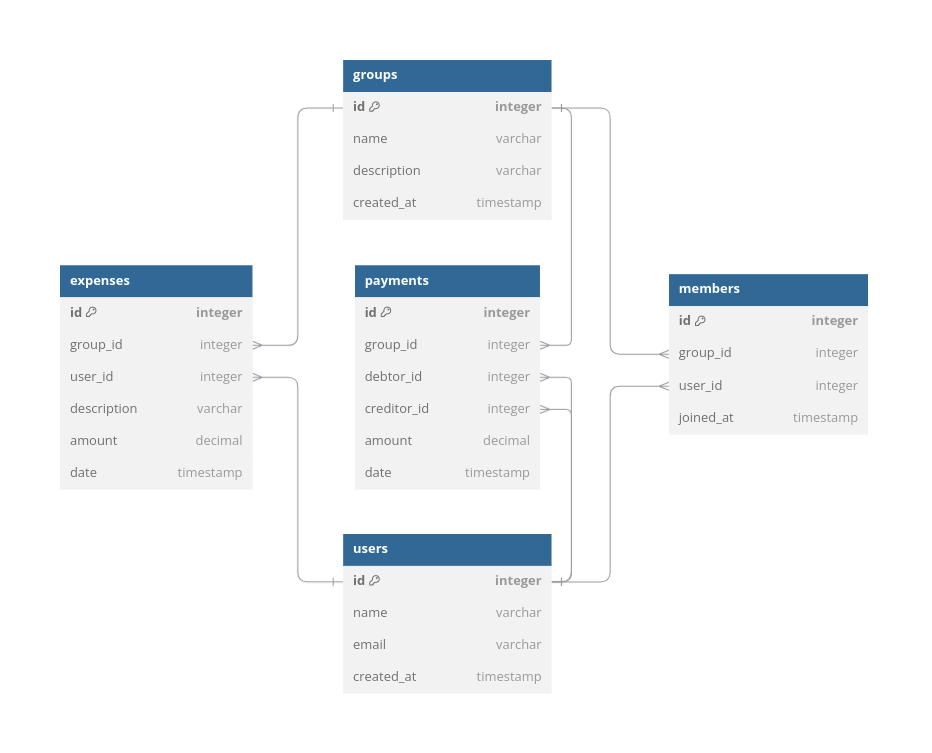

# SplitEasy API

## Idea
SplitEasy es una aplicación para gestionar gastos compartidos entre grupos de personas. Permite a los usuarios registrar gastos, calcular balances, y simplificar el proceso de liquidación.

## Tablas

## Usuarios (`users`)
| Campo         | Tipo de dato       | Descripción                            |
|---------------|--------------------|----------------------------------------|
| `id`          | PK, entero         | Clave primaria del usuario.            |
| `name`        | Texto              | Nombre del usuario.                    |
| `email`       | Texto, único       | Correo electrónico del usuario.        |
| `created_at`  | Timestamp          | Fecha de creación del usuario.         |

## Grupos (`groups`)
| Campo         | Tipo de dato       | Descripción                            |
|---------------|--------------------|----------------------------------------|
| `id`          | PK, entero         | Clave primaria del grupo.              |
| `name`        | Texto              | Nombre del grupo.                      |
| `description` | Texto, opcional    | Breve descripción del grupo.           |
| `created_at`  | Timestamp          | Fecha de creación del grupo.           |

## Miembros (`members`)
| Campo         | Tipo de dato       | Descripción                            |
|---------------|--------------------|----------------------------------------|
| `id`          | PK, entero         | Clave primaria del miembro.            |
| `group_id`    | FK, entero         | Grupo al que pertenece.                |
| `user_id`     | FK, entero         | Usuario que es miembro.                |
| `joined_at`   | Timestamp          | Fecha en la que el usuario se unió.    |

## Gastos (`expenses`)
| Campo         | Tipo de dato       | Descripción                            |
|---------------|--------------------|----------------------------------------|
| `id`          | PK, entero         | Clave primaria del gasto.              |
| `group_id`    | FK, entero         | Grupo al que pertenece el gasto.       |
| `user_id`     | FK, entero         | Usuario que realizó el gasto.          |
| `description` | Texto              | Descripción breve del gasto.           |
| `amount`      | Decimal            | Monto del gasto.                       |
| `date`        | Timestamp          | Fecha del gasto.                       |

## Pagos (`payments`)
| Campo         | Tipo de dato       | Descripción                            |
|---------------|--------------------|----------------------------------------|
| `id`          | PK, entero         | Clave primaria del pago.               |
| `group_id`    | FK, entero         | Grupo al que pertenece el pago.        |
| `debtor_id`   | FK, entero         | Usuario que debe pagar.                |
| `creditor_id` | FK, entero         | Usuario que recibe el pago.            |
| `amount`      | Decimal            | Monto del pago.                        |
| `date`        | Timestamp          | Fecha del pago.                        |

# Modelo Entidad - Relación

## Objetivo principal
Crear una base de datos que permita:
1. Registrar usuarios y sus interacciones dentro de grupos.
2. Organizar gastos compartidos entre miembros de un grupo.
3. Facilitar el cálculo y registro de pagos necesarios para saldar las deudas entre amigos.
