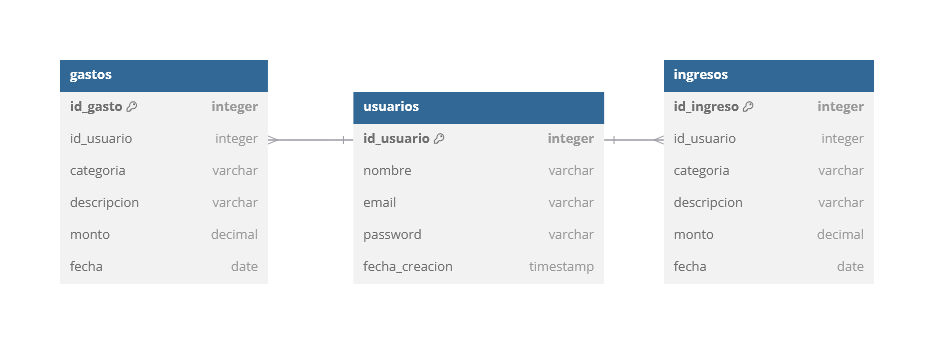

# FinancyWise API


## Idea
FinancyWise es una aplicación para gestionar finanzas personales. Su propósito es ayudar a los usuarios a rastrear ingresos y gastos, analizar su comportamiento financiero y tomar decisiones más informadas para mejorar su bienestar económico.

## Justificación de la Idea

### 1. **Problema Detectado**
La falta de control sobre los ingresos y gastos dificulta la planificación financiera, llevando a decisiones económicas poco efectivas. Muchas personas no cuentan con herramientas claras para visualizar sus hábitos de consumo.

### 2. **Solución Propuesta**
FinancyWise ofrece:
- Una plataforma intuitiva para registrar y organizar transacciones.
- Visualizaciones detalladas de los patrones de gasto e ingreso.
- Insights personalizados que fomenten el ahorro y mejoren el uso de los recursos.
## Tablas

### 1. Tabla `usuarios`
Contiene la información de los usuarios.

| Campo            | Tipo            | Detalles                      |
|------------------|-----------------|-------------------------------|
| `id_usuario`     | BIGINT          | PK, autoincremental           |
| `username`       | VARCHAR(100)    | No nulo                       |
| `email`          | VARCHAR(150)    | No nulo, único                |
| `password`       | VARCHAR(255)    | No nulo (almacenada de forma segura) |
| `fecha_creacion` | TIMESTAMP     | No nulo, valor por defecto ahora() |

---

### 2. Tabla `gastos`
Contiene los gastos realizados por los usuarios.

| Campo          | Tipo         | Detalles                      |
|----------------|--------------|-------------------------------|
| `id_gasto`     | BIGINT       | PK, autoincremental           |
| `id_usuario`   | BIGINT       | FK, referencia a `usuarios.id_usuario` |
| `categoria`    | VARCHAR(50)  | No nulo (ej.: comida, transporte) |
| `descripcion`  | VARCHAR(255) | Opcional                      |
| `monto`        | DECIMAL(10,2)| No nulo                       |
| `fecha`        | DATE         | No nulo                       |

---

### 3. Tabla `ingresos`
Contiene los ingresos registrados por los usuarios.

| Campo          | Tipo         | Detalles                      |
|----------------|--------------|-------------------------------|
| `id_ingreso`   | BIGINT       | PK, autoincremental           |
| `id_usuario`   | BIGINT       | FK, referencia a `usuarios.id_usuario` |
| `categoria`    | VARCHAR(50)  | No nulo (ej.: sueldo, inversión) |
| `descripcion`  | VARCHAR(255) | Opcional                      |
| `monto`        | DECIMAL(10,2)| No nulo                       |
| `fecha`        | DATE         | No nulo                       |

---

# Modelo Entidad - Relación



## Endpoints

### 1. **Usuarios**
- **POST** `/usuarios/register`: Registra un nuevo usuario.  
  **Cuerpo de la solicitud**: Detalles del usuario en formato JSON.  
  **Respuesta**:
  - **201 Created**: Usuario registrado exitosamente.
  - **400 Bad Request**: El username o email ya están en uso.

- **POST** `/usuarios/login`: Realiza el inicio de sesión de un usuario.  
  **Cuerpo de la solicitud**: Credenciales del usuario (username y password) en formato JSON.  
  **Respuesta**:
  - **201 Created**: Inicio de sesión exitoso, devuelve un token de autenticación.
  - **401 Unauthorized**: Credenciales incorrectas.

- **GET** `/usuarios/{username}`: Obtiene la información de un usuario por su username.  
  **Respuesta**:
  - **200 OK**: Detalles del usuario en formato JSON.
  - **403 Forbidden**: Acceso denegado si el usuario autenticado no es el dueño o un administrador.

- **GET** `/usuarios`: Obtiene la lista de todos los usuarios.  
  **Respuesta**:
  - **200 OK**: Lista de usuarios en formato JSON.
  - **403 Forbidden**: Acceso denegado si el usuario no es administrador.

- **PUT** `/usuarios/{id}`: Actualiza la información de un usuario.  
  **Cuerpo de la solicitud**: Nuevos datos del usuario en formato JSON.  
  **Respuesta**:
  - **200 OK**: Usuario actualizado exitosamente.
  - **403 Forbidden**: Acceso denegado si el usuario autenticado no es el dueño o un administrador.

- **DELETE** `/usuarios/{id}`: Elimina un usuario por su ID.  
  **Respuesta**:
  - **200 OK**: Usuario eliminado exitosamente.
  - **403 Forbidden**: Acceso denegado si el usuario no es administrador.


### 2. **Gastos**
- **POST** `/gastos/{idUsuario}`: Registra un nuevo gasto asociado a un usuario.  
  **Cuerpo de la solicitud**: Detalles del gasto en formato JSON.  
  **Respuesta**:
  - **201 Created**: Gasto registrado exitosamente.
  - **403 Forbidden**: Acceso denegado si el usuario autenticado no tiene permisos.

- **GET** `/gastos`: Obtiene todos los gastos registrados.  
  **Respuesta**:
  - **200 OK**: Lista de gastos en formato JSON.
  - **204 No Content**: No hay gastos registrados.
  - **403 Forbidden**: Acceso denegado si el usuario no es administrador.

- **GET** `/gastos/usuario/{idUsuario}`: Obtiene los gastos registrados por un usuario específico.  
  **Respuesta**:
  - **200 OK**: Lista de gastos en formato JSON.
  - **204 No Content**: El usuario no tiene gastos registrados.
  - **403 Forbidden**: Acceso denegado si el usuario autenticado no tiene permisos.

- **GET** `/gastos/{idGasto}`: Obtiene un gasto específico por su ID.  
  **Respuesta**:
  - **200 OK**: Detalles del gasto en formato JSON.
  - **403 Forbidden**: Acceso denegado si el usuario autenticado no es propietario del gasto ni tiene rol de administrador.

- **PUT** `/gastos/{idGasto}`: Actualiza un gasto existente.  
  **Cuerpo de la solicitud**: Nuevos detalles del gasto en formato JSON.  
  **Respuesta**:
  - **200 OK**: Gasto actualizado exitosamente.
  - **403 Forbidden**: Acceso denegado si el usuario autenticado no es propietario del gasto ni tiene rol de administrador.

- **DELETE** `/gastos/{idGasto}`: Elimina un gasto específico.  
  **Respuesta**:
  - **200 OK**: Gasto eliminado exitosamente.
  - **403 Forbidden**: Acceso denegado si el usuario autenticado no es propietario del gasto ni tiene rol de administrador.


### 3. **Ingresos**
- **POST** `/ingresos/{idUsuario}`: Registra un nuevo ingreso asociado a un usuario.  
  **Cuerpo de la solicitud**: Detalles del ingreso en formato JSON.  
  **Respuesta**:
  - **201 Created**: Ingreso registrado exitosamente.
  - **403 Forbidden**: Acceso denegado si no eres el propietario del ingreso o administrador.

- **GET** `/ingresos`: Obtiene todos los ingresos registrados.  
  **Respuesta**:
  - **200 OK**: Lista de ingresos en formato JSON.
  - **204 No Content**: No hay ingresos registrados.
  - **403 Forbidden**: Acceso denegado si no eres administrador.

- **GET** `/ingresos/usuario/{idUsuario}`: Obtiene todos los ingresos de un usuario específico.  
  **Respuesta**:
  - **200 OK**: Lista de ingresos del usuario en formato JSON.
  - **204 No Content**: El usuario no tiene ingresos registrados.
  - **403 Forbidden**: Acceso denegado si no eres el propietario del ingreso o administrador.

- **GET** `/ingresos/{idIngreso}`: Obtiene los detalles de un ingreso específico.  
  **Respuesta**:
  - **200 OK**: Detalles del ingreso en formato JSON.
  - **403 Forbidden**: Acceso denegado si no eres el propietario del ingreso o administrador.

- **PUT** `/ingresos/{idIngreso}`: Actualiza un ingreso existente.  
  **Cuerpo de la solicitud**: Nuevos datos del ingreso en formato JSON.  
  **Respuesta**:
  - **200 OK**: Ingreso actualizado exitosamente.
  - **403 Forbidden**: Acceso denegado si no eres el propietario del ingreso o administrador.

- **DELETE** `/ingresos/{idIngreso}`: Elimina un ingreso.  
  **Respuesta**:
  - **200 OK**: Ingreso eliminado exitosamente.
  - **403 Forbidden**: Acceso denegado si no eres el propietario del ingreso o administrador.

---
## Lógica de Negocio

La API Rest tiene como objetivo principal gestionar los ingresos, gastos y usuarios para brindar a los usuarios un control efectivo sobre sus finanzas personales. La lógica de negocio está estructurada de la siguiente manera:

### 1. **Gestión de Usuarios**
- Los usuarios pueden registrarse en la plataforma con un nombre de usuario único, una contraseña segura y un correo electrónico válido.
- Los usuarios pueden actualizar su información personal, como nombre de usuario, correo electrónico y contraseña.
- Los usuarios pueden eliminar su cuenta, lo que elimina todos sus datos asociados.
- **Control de acceso**: Los administradores pueden gestionar todos los usuarios, pero cada usuario solo puede acceder y modificar su propia información. La validación de acceso se basa en roles (usuario o administrador).

### 2. **Gestión de Ingresos**
- Los usuarios pueden agregar nuevos ingresos, incluyendo detalles como el monto, la categoría, la descripción y la fecha.
- Los usuarios pueden actualizar los detalles de los ingresos existentes, como la categoría o el monto, si es necesario.
- Los usuarios pueden eliminar ingresos previos de su historial.
- **Propietario del ingreso**: Solo el propietario del ingreso o un administrador pueden editar o eliminar el ingreso.
- Los ingresos se asocian directamente con el usuario que los registra.

### 3. **Gestión de Gastos**
- Los usuarios pueden registrar sus gastos, incluyendo información como monto, categoría, descripción y fecha.
- Los usuarios pueden actualizar los gastos existentes, modificando detalles como la categoría o el monto.
- Los usuarios pueden eliminar los gastos de su historial.
- **Propietario del gasto**: Al igual que con los ingresos, solo el propietario del gasto o un administrador puede modificar o eliminar el gasto.
- Los gastos se agrupan por categorías, lo que permite al usuario tener un desglose detallado de en qué está gastando.

### 4. **Control de Acceso y Seguridad**
- Los usuarios deben autenticarse antes de acceder a sus datos o realizar cambios en su información personal.
- Los administradores tienen un control completo sobre todos los usuarios y sus datos, mientras que los usuarios regulares solo tienen acceso a sus propios ingresos, gastos e información personal.
- Los roles y permisos de acceso se gestionan a través de Spring Security, asegurando que solo las personas autorizadas puedan realizar ciertas acciones.

## Excepciones y Códigos de Estado

La aplicación manejará las siguientes excepciones y devolverá los códigos de estado correspondientes:

### 1. Usuario no encontrado
- **Código de estado**: `404 Not Found`
- **Mensaje**: `"Usuario con ID/username no encontrado"`

### 2. Gasto no encontrado
- **Código de estado**: `404 Not Found`
- **Mensaje**: `"Gasto con ID no encontrado"`

### 3. Ingreso no encontrado
- **Código de estado**: `404 Not Found`
- **Mensaje**: `"Ingreso con ID no encontrado"`

### 4. Validación de datos
- **Código de estado**: `400 Bad Request`
- **Mensajes posibles**:
  - `"El username ya está en uso"`
  - `"El email ya está en uso"`
  - `"Datos de solicitud no válidos"`

### 5. Acceso denegado
- **Código de estado**: `403 Forbidden`
- **Mensajes posibles**:
  - `"Acceso denegado: No eres el propietario del ingreso"`
  - `"Acceso denegado: No eres el propietario del recurso"`
  - `"Acceso denegado"`

### 6. Error en el servidor
- **Código de estado**: `500 Internal Server Error`
- **Mensaje**: `"Ha ocurrido un error en el servidor"`

---
## Restricciones de Seguridad en la API REST

La seguridad se maneja mediante una configuración detallada en **Spring Security**. Las restricciones implementadas aseguran que los usuarios solo puedan acceder a los recursos adecuados según sus roles y autenticación.

### 1. **Desactivación de CSRF (Cross-Site Request Forgery)**
- **Motivo**: Se desactiva la protección contra CSRF debido a que la API está diseñada para ser utilizada por clientes externos y no para un navegador con estado.
- **Código**:
  ```kotlin
  .csrf { csrf -> csrf.disable() }
  ```

### 2. **Autenticación en Rutas**
- **Rutas públicas**:
  - Las rutas `/usuarios/login` y `/usuarios/register` están permitidas sin autenticación previa, lo que permite a los usuarios registrarse e iniciar sesión en la aplicación.
- **Rutas protegidas**:
  - Las rutas `/ingresos/*` y `/gastos/*` requieren autenticación. Los usuarios deben estar autenticados para acceder a estas rutas, lo que garantiza que solo los usuarios registrados puedan gestionar sus ingresos y gastos.
  - Se asegura que todas las demás rutas también estén protegidas mediante autenticación.

- **Código**:
  ```kotlin
  .authorizeHttpRequests { auth -> auth
      .requestMatchers("/usuarios/login").permitAll()
      .requestMatchers("/usuarios/register").permitAll()
      .requestMatchers("/ingresos/*").authenticated()
      .requestMatchers("/gastos/*").authenticated()
      .anyRequest().authenticated()
  }
  ```

### 3. **Autenticación basada en JWT**
- **JWT (JSON Web Token)**: La autenticación se maneja a través de JWT. Cada solicitud debe incluir un token JWT válido para acceder a los recursos protegidos.
- **OAuth2 Resource Server**: Se configura la API como un servidor de recursos OAuth2, utilizando JWT para la autenticación. Esto permite verificar el token en cada solicitud.
- **Código**:
  ```kotlin
  .oauth2ResourceServer { oauth -> oauth.jwt(Customizer.withDefaults()) }
  ```

### 4. **Política de Sesión Stateless**
- **Sesiones sin estado**: La aplicación está configurada para no mantener sesiones de usuario en el servidor. Cada solicitud debe incluir un JWT válido en los encabezados, eliminando la necesidad de almacenar el estado de la sesión.
- **Código**:
  ```kotlin
  .sessionManagement { session -> session.sessionCreationPolicy(SessionCreationPolicy.STATELESS) }
  ```

### 5. **Codificación de Contraseñas**
- Las contraseñas de los usuarios se codifican utilizando el algoritmo **BCrypt** para garantizar su seguridad en la base de datos.
- **Código**:
  ```kotlin
  @Bean
  fun passwordEncoder() : PasswordEncoder {
      return BCryptPasswordEncoder()
  }
  ```

### 6. **Generación y Decodificación de JWT**
- **Generación de JWT**: El servidor genera un JWT utilizando una clave RSA privada y pública para firmar el token. La clave pública se utiliza para validar la firma del token en cada solicitud.
- **Decodificación de JWT**: Se configura un **JWT Decoder** que verifica la firma del token JWT usando la clave pública y extrae la información del usuario.
- **Código**:
  ```kotlin
  @Bean
  fun jwtEncoder(): JwtEncoder {
      val jwk: JWK = RSAKey.Builder(rsaKeys.publicKey).privateKey(rsaKeys.privateKey).build()
      val jwks: JWKSource<SecurityContext> = ImmutableJWKSet(JWKSet(jwk))
      return NimbusJwtEncoder(jwks)
  }

  @Bean
  fun jwtDecoder(): JwtDecoder {
      return NimbusJwtDecoder.withPublicKey(rsaKeys.publicKey).build()
  }
  ```
